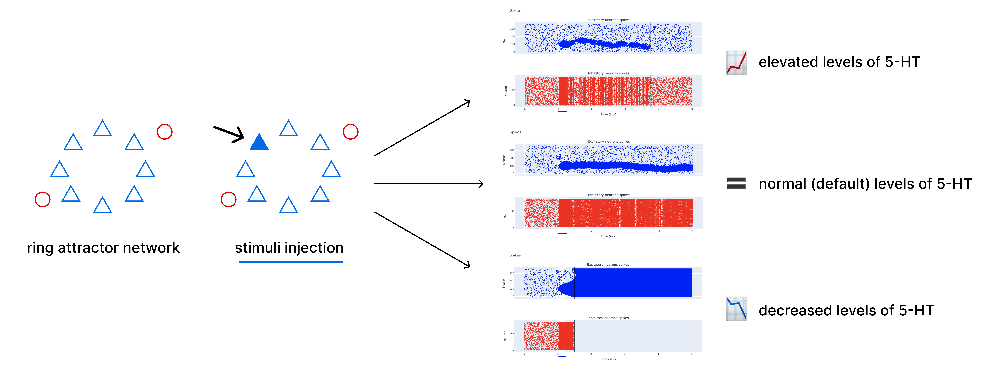
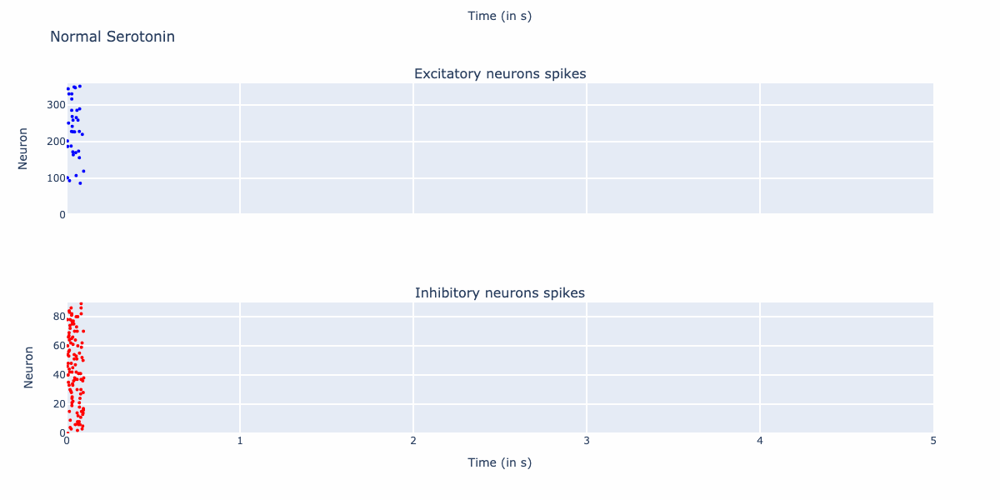
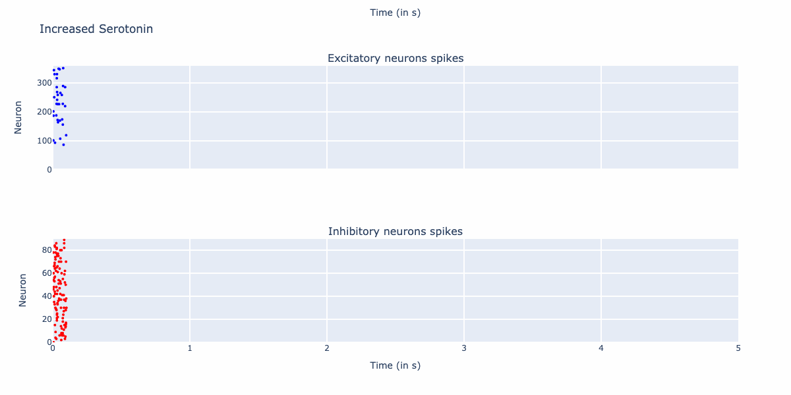
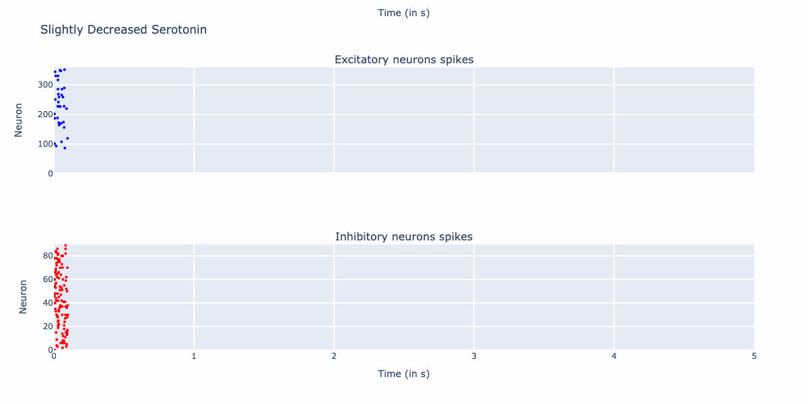

<h1 style="text-align: center;"> Serotonin Neuromodulation of Attention Modelling </h1>

Implemetation of the ring attractor network and simulation trials as the part of the undergraduate thesis conducted by [Hlib Solodzhuk](https://www.linkedin.com/in/hlib-solodzhuk-508022210/) under the supervision of [Yohan J. John](https://yohanjohn.com/about/).

## 🧪 Abstract

Attention is the ability to flexibly allocate a limited amount of computational resources to the propagation, procession, and utilization of the relevant information from the environment. The study of its modulation is crucial for understanding our, frankly, the most vital cognitive function, designing drug therapy for curing its dysfunction and developing intelligent agents by adapting efficient mechanisms. Serotonin (5-HT) is one of the essential neuromodulators in the nervous system, which participates in mood and perception regulation as well as anxiety and stress coping mechanisms. Though the experimental findings in the field suggest potential anatomical overlaps between serotonin and structures that support attention allocation, the underlying mechanisms for the causal effect remain unknown.

In this study, we develop a computational model of a ring attractor network consisting of RS excitatory neurons and FS inhibitory interneurons. When presented with external stimuli, the circuit is able to transfer from the spontaneous state to the attractor one, which remembers the stimuli even after their removal. Then, we assess the serotonin's impact on the dynamics of the network by changing its concentration. We reveal that decreased and increased levels of 5-HT impair the network's ability to remember the stimuli; however, this is due to different changes in its qualitative behavior, which aligns with the available literature on serotonin's modulation function.

## 🗂️ Repository Organization

All of the relevant files to the implementation and experiments can be divided in three broad categories based on their functional input:

- parameter files (`*.yaml`, located in `utils/`), which contain the constant values of the parameters used in the evaluation of network dynamics;

- utility and simulation procedure files (`*.py`, located in `utils/`), which include plotting functions as well as definition of the simulation run itself by evolving the system through the desrcibed dynamics;

- simulation trials files (`*.ipynb`, located in root folder), where each of the notebooks presents separate experiment. These notebooks are self-explanatory inside, still the general overview is the following:

| Notebook                          | Description                                                                                                                          |
| --------------------------------- | ------------------------------------------------------------------------------------------------------------------------------------ |
| `excitatory_neuron.ipynb`         | Simulation of one RS excitatory neuron which receives DC current (test for Izhikevich's parameters).                                 |
| `inhibitory_neuron.ipynb`         | Simulation of one FS inhibitory interneuron which receives DC current (test for Izhikevich's parameters).                            |
| `receptor_kinetics.ipynb`         | Simulation of the simultaneous spiking in FS and RS neuron to observe the dynamics of the receptor kinetics.                         |
| `spontaneous_state.ipynb`         | Simulation of the spontaneous state activity in the network (Section 5.1).                                                           |
| `attractor_state.ipynb`           | Simulation of the attractor state activity in the network (Section 5.1).                                                             |
| `attractor_state_serotonin.ipynb` | Simulation of the attractor state activity in the network for different concentrations of serotonin (Section 5.2).                   |
| `animaions.ipynb`                 | Simulation of the attractor state activity in the network for different concentrations of serotonin for creating GIF-visualizations. |

## 🛠️ Set up

You can clone repository and explore it locally:

1. `git clone git@github.com:glibesyck/Undergradute-Thesis-Serotonin-Neuromodulation-Attention-Modeling.git`
2. `pip install -r requirements.txt`

Alternatively, there is [interactive environment](https://mybinder.org/v2/gh/glibesyck/Undergradute-Thesis-Serotonin-Neuromodulation-Attention-Modeling/HEAD) in Binder where you can do that without any additional installments.

## 🎯 Results

Network's dynamics allow it to exhibit attractor state after the removal of the stimuli. Moreover, we can notice the increased, and what is even more important, synchronized activity of the inhibitory neurons, which is crucial for successful attention allocation from the experimental findings

Computational odel suggests that higher doses of 5-HT compromise the network's ability to sustain attention resources over longer periods, which results in an abrupt transition to the spontaneous state activity (forgetting of the stimuli). Observe the interactive visualization for $\mu = 0.97$.

A slight lowering of the 5-HT level (for $\mu = 1.01$) is generally plausible and keeps firing rates of the neurons as desired, even increasing them for more, which might suggest better stability in the long-term perspective.

However, further decrease (for $\mu = 1.02$) causes the circuit to locate itself in the state of the overstimulated excitation where inhibitory neurons almost do not fire at all, while, in contrast, all excitatory neurons fire at extremely elevated rates.

Thus, the network's deficiency in the performance for successful attention allocation comes from the distinct dynamics being evolved in elevated and lowered serotonin levels.
